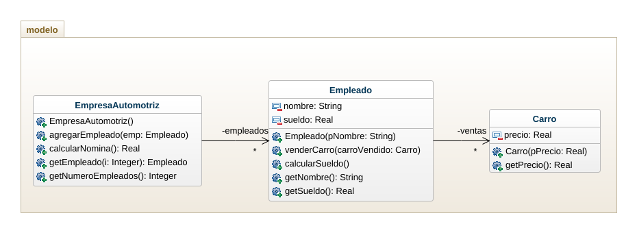
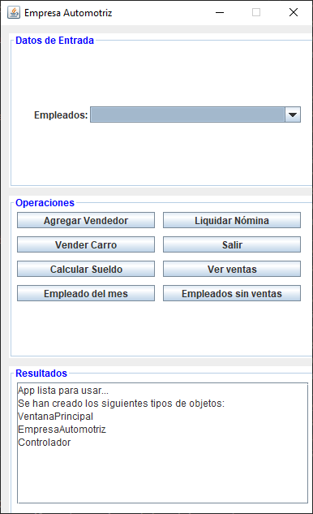
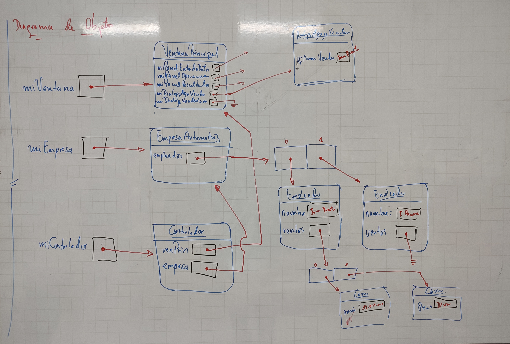

# EmpresaAutomotriz2

El sueldo que perciben los vendedores de una empresa automotriz está integrado de la siguiente manera:
- Salario mínimo
- $100000 por cada carro vendido
- 2% del valor de los autos vendidos

Se tienen varios vendedores, y por cada vendedor se tiene el nombre y el precio de cada carro que vendió en el mes.  Es posible que algunos vendedores no hayan realizado venta alguna; en tal caso sólo se tendrá el nombre.

Elaborar un programa que permita leer los datos e imprimir el reporte de nómina mensual.

## EJERCICIOS CASO EMPRESA AUTOMOTRIZ

1. Ampliar el panel operaciones de tal forma que se puedan agregar nuevos botones para darle algunas funcionalidades nuevas a la app, tanto para un Empleado, como para la Empresa.
2. Agregar dos atributos nuevos tanto a la clase Empleado como a la clase Carro, que sean relevantes en el contexto del problema que se está resolviendo.
3. Agregar una funcionalidad nueva a la app que permita mostrar la totalidad de ventas hechas por un vendedor, en orden ascendente.  Este reporte debe incluir la información de cada carro vendido junto a las ganancias que la venta de ese carro representan para el empleado.
4. Agregar una funcionalidad para mostrar el "Empleado del mes", es decir, aquel que mas ventas alcanzó.
5. Agregar una funcionalidad para mostrar la lista de empleados que no realizaron ventas durante el mes.
6. En cada caso agregue pantallazos de la vista o gui de la app, en funcionamiento.

## Diagrama de Clases

## vista

## Diagrama objetos

